<!DOCTYPE html>
<html lang="ko">

<head>
&#x20;   <meta charset="UTF-8">
</head>

<body>

<header>
&#x20;   <h1>개요</h1>
&#x20;   
Windows PowerShell(콘솔)을 이용하여, 던파 API 서버에 다이렉트로 데이터를 요청하고 활용할 수 있습니다.

</header>

 

<section>

&#x20;   <h1>사용 방법</h1>

&#x20;   

		
<h3>다운로드(클릭)</h3>

		

			 <a href="#"><kbd>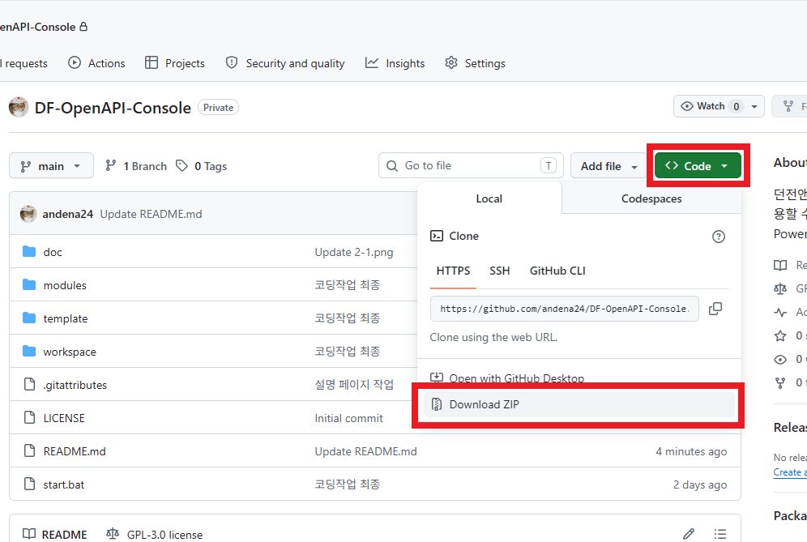</kbd></a>
			 프로젝트 페이지에서 위와 같이 Zip파일을 다운로드 합니다.
			 
			 <a href="#"><kbd>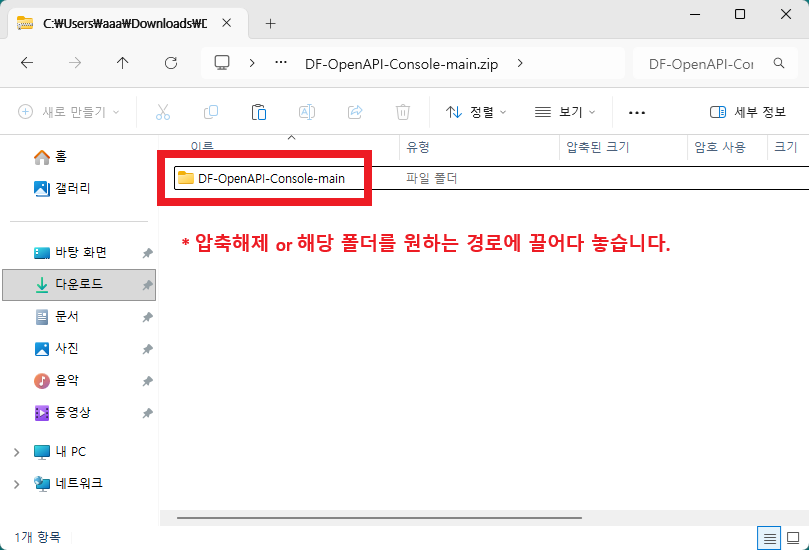</kbd></a>
			 원하는 경로에 압축풀기 or 끌어다 놓습니다.
			 
			 <a href="#"><kbd>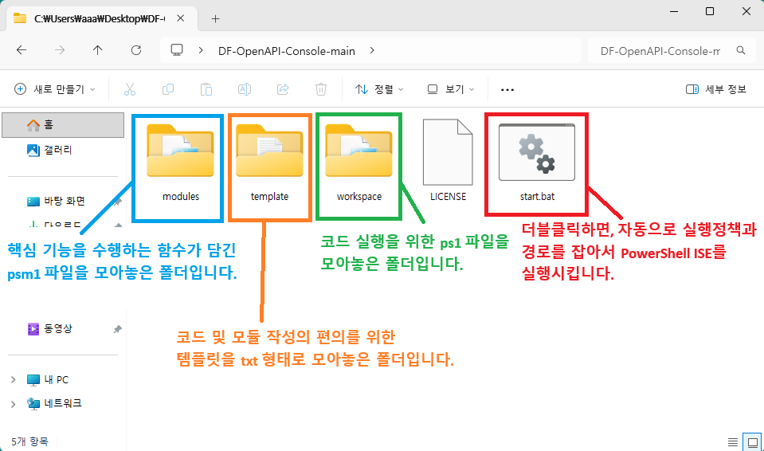</kbd></a>
			 start.bat를 더블클릭하여, Windows PowerShell ISE를 실행시키면, 준비완료입니다.
			 그외 각 파일 및 폴더에 대한 설명은 위와 같습니다.
			 
			 <a href="#"><kbd>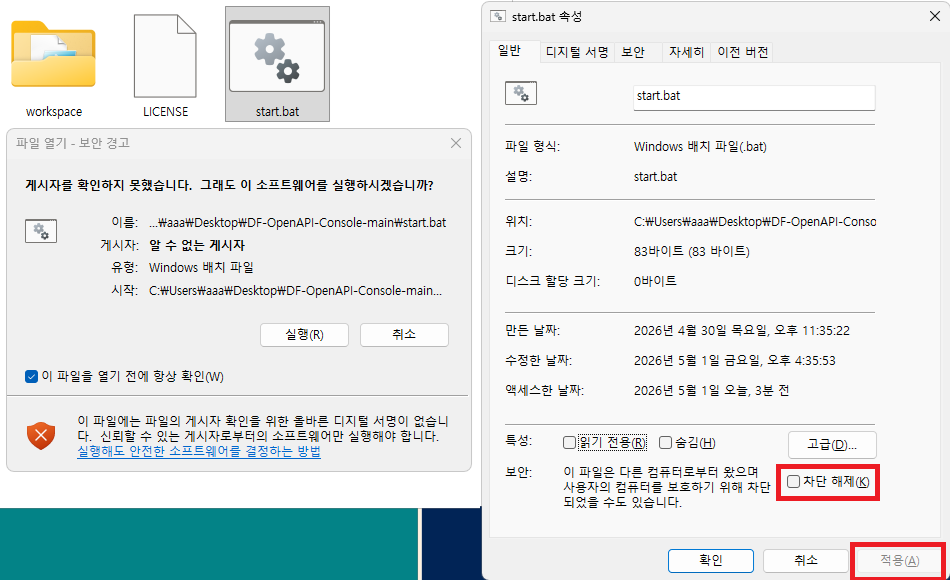</kbd></a>
			 '보안 경고'가 거슬리는 경우, 우클릭 > 속성 > 차단해체 체크 > 적용하면 됩니다.
			 
			 <a href="#"><kbd>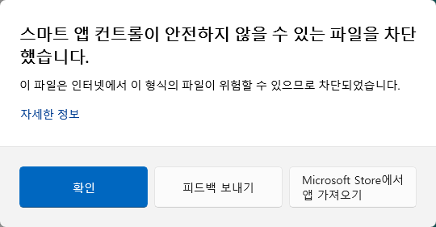</kbd></a>
			 '스마트 앱 컨트롤'이 켜진 상태면, 위와 같은 창이 표시되며 실행이 불가할 수 있습니다.
			 마찬가지로, 우클릭 > 속성 > 차단해체 체크 > 적용하면 해결됩니다.
			 
			 (* Windows 보안 > 앱 및 브라우저 컨트롤 > 스마트 앱 컨트롤 설정에서, on/off 여부 확인가능)
			 
		

	    

&#x20;   

		
<h3>API키 발급하기(클릭)</h3>

		

			 <a href="#"><kbd>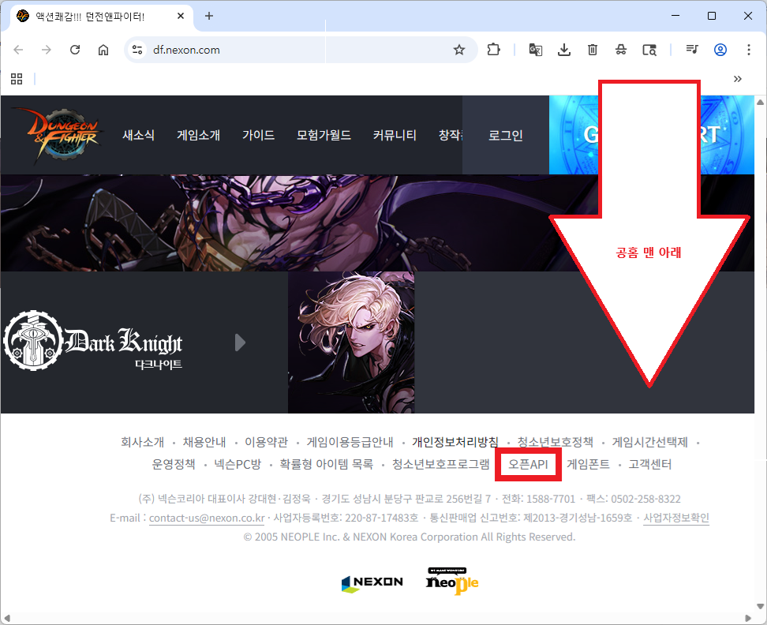</kbd></a>
			 던파 공식홈페이지 맨 아래에 있는 '오픈API'를 클릭합니다.
			 
			 <a href="#"><kbd>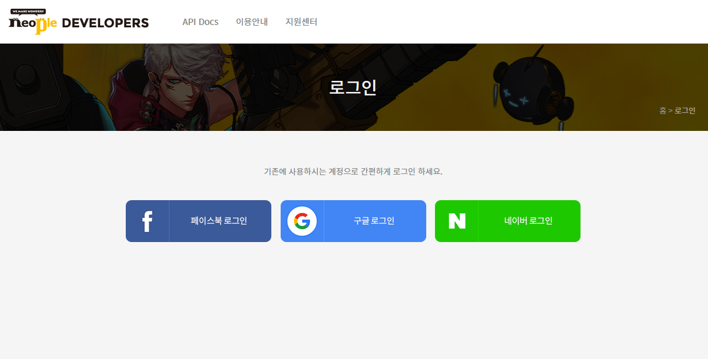</kbd></a>
			 페이스북 or 구글 or 네이버 계정으로 로그인 합니다.
			 
			 <a href="#"><kbd>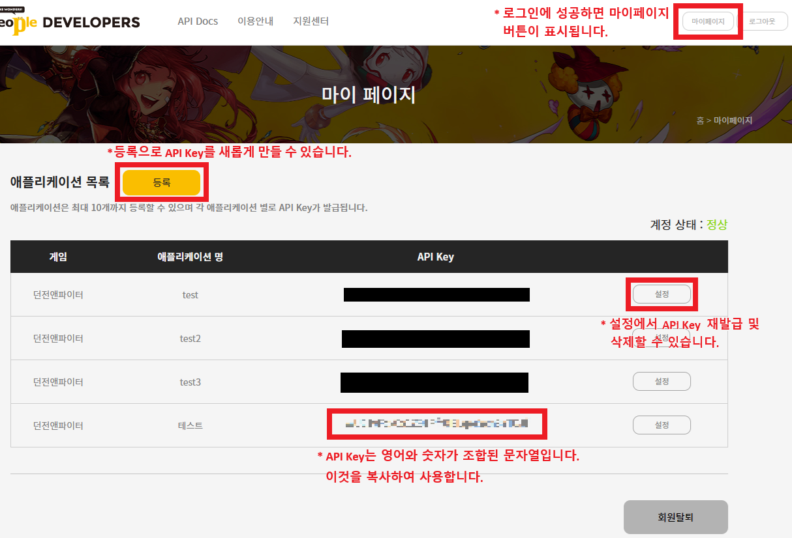</kbd></a>
			 로그인 후 진입가능한 '마이페이지'에서, API Key를 생성, 재발급, 삭제할 수 있습니다.
			 
		

	    

&#x20;   

		
<h3>실행하기(클릭)</h3>

		

			 <a href="#"><kbd>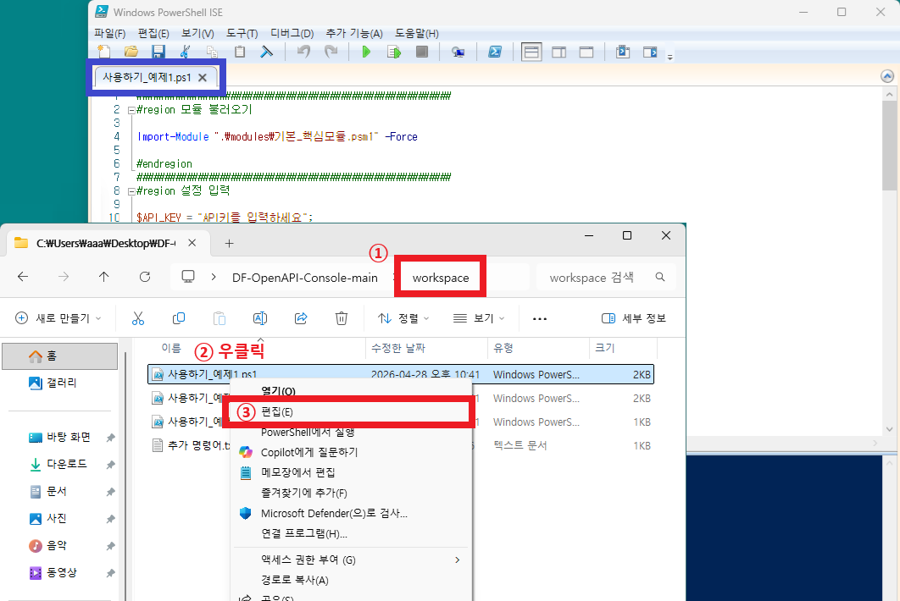</kbd></a>
			 workspace 폴더 진입 > ps1파일 우클릭 > 편집
			 : 열려있던 PowerShell ISE 내에 해당 ps1파일이 표시됩니다.
			 
			 <a href="#"><kbd>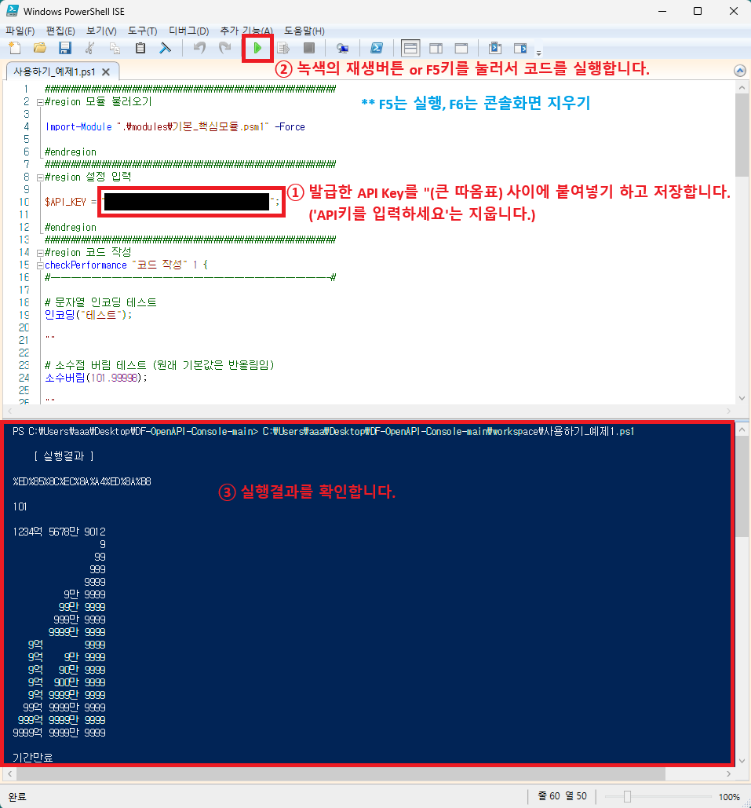</kbd></a>
			 발급한 API Key를 위와 같이 입력하고, 저장하고, F5를 눌러서 실행하여 결과를 확인합니다.
			 
		

	    

&#x20;   

		
<h3>새로만들기(클릭)</h3>

		

			 <a href="#"><kbd>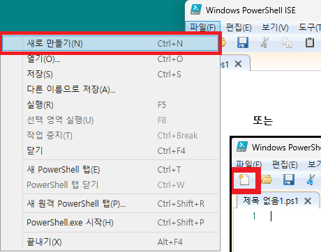</kbd></a>
			 PowerShell ISE에서 위와 같이, 코드 파일을 새로 만들 수 있습니다.
			 
			 <a href="#"><kbd>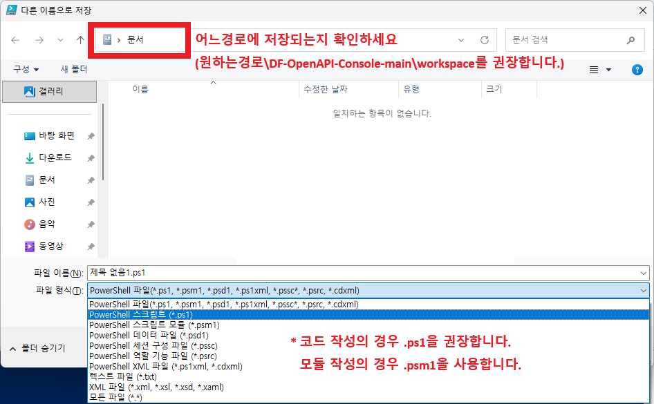</kbd></a>
			 처음 Ctrl+S를 눌러 저장을 시도하면 위와 같은 창이 표시됩니다.
			 경로를 확인하고, 파일형식을 ps1으로 하여 저장합니다.
			 
			 <a href="#"><kbd>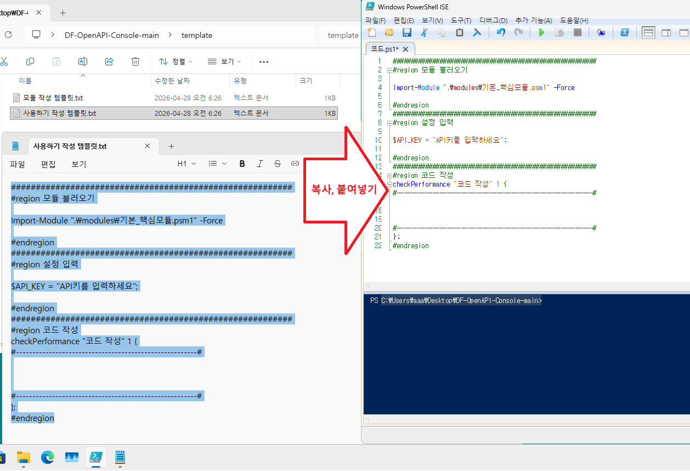</kbd></a>
			 template 폴더의 '사용하기 작성 템플릿.txt'의 내용을 복사 붙여넣기하고 저장합니다.
			 
			 <a href="#"><kbd>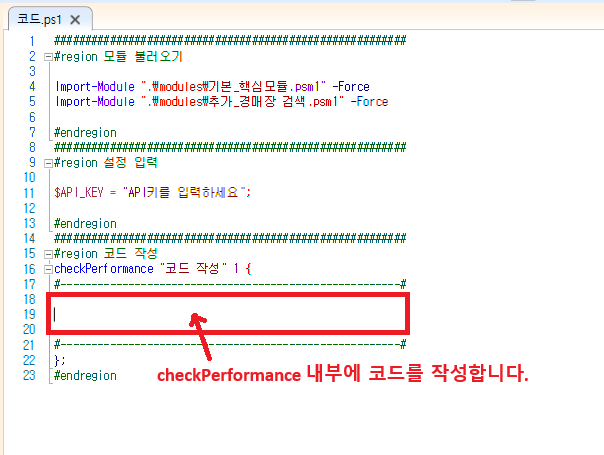</kbd></a>
			 예제를 참고하여 checkPerformance 내부에 원하는 코드를 작성합니다.
			 
		

	    

&#x20;   

		
<h3>추가정보(클릭)</h3>

		

			 서버가 점검 중일때
			 <a href="#"><kbd>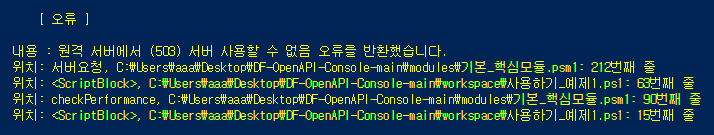</kbd></a>
			 
			 API Key가 유효하지 않을때
			 <a href="#"><kbd>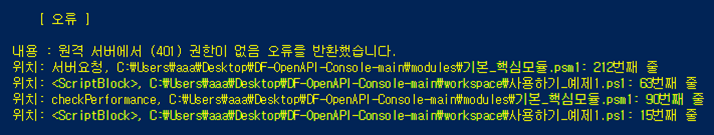</kbd></a>
			 
			 같은 데이터 요청에 대해, 새로운 결과를 받으려면 1분이 경과해야합니다.
			 <a href="#"><kbd>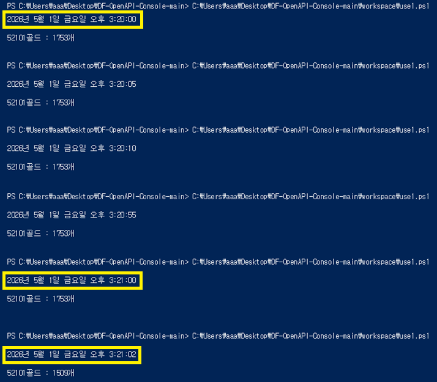</kbd></a>
			 
		

	    

</section>

 

<section>

&#x20;   <h1>기타</h1>

&#x20;   
문의사항은 아래 채널을 이용해주세요.

&#x20;   <ul>

&#x20;       <li>
			GitHub : <a href="https://github.com/andena24">https://github.com/andena24</a>
		</li>

&#x20;       <li>
			YouTube : <a href="https://www.youtube.com/@%EC%95%8A%EB%8D%B0%EB%83%90">@않데냐</a>
		</li>

&#x20;       <li>
			Discord : @andena24
		</li>

&#x20;       <li>
			KakaoTalk : <a href="https://open.kakao.com/o/sj9iTcpi">https://open.kakao.com/o/sj9iTcpi</a>
		</li>

&#x20;   </ul>

</section>

 

<footer>

&#x20;   <h2>Copyright (c) 2026 않데냐. Licensed under GPL-3.0.</h2>

</footer>

</body>

</html>